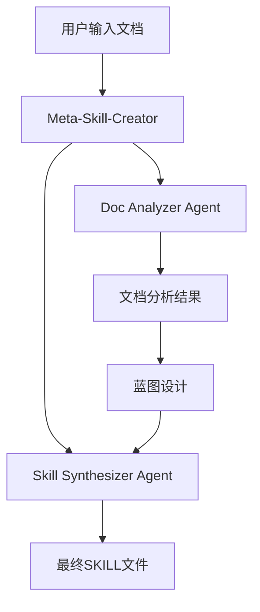

# Meta-Skill-Creator 🚀

一个强大的Claude技能自动化生成工具，能够从技术文档自动生成结构化的Claude Skills，支持用户协作式蓝图设计和渐进式内容展示。

[](https://www.anthropic.com/engineering/equipping-agents-for-the-real-world-with-agent-skills)
[](LICENSE)

## ✨ 核心特性

- 🔄 **自动化技能生成**: 从技术文档一键生成标准Claude Skills
- 🎯 **智能蓝图设计**: 支持多种技能规划方案（完整SDK、核心功能、模块化）
- 📚 **渐进式内容展示**: 采用三层信息披露架构，优化上下文使用
- 🤖 **多Agent协作**: 通过专业子Agent实现文档分析和技能合成
- 🛠️ **标准化输出**: 严格遵循Anthropic技能标准和最佳实践

## 🏗️ 工作原理

### Agent Skills 架构

本项目基于Anthropic的Agent Skills理念，将专业知识打包为可组合资源：

1. **Level 1: 元数据** - 始终加载的系统提示信息 (~100词)
2. **Level 2: 主要内容** - 技能触发时加载的SKILL.md (<5k词)
3. **Level 3: 按需资源** - references/目录中的详细文档

### 核心Agent架构



#### 1. Meta-Skill-Creator (主Agent)
- **角色**: 总架构师和用户唯一交互点
- **职责**: 整个文档到技能的自动化工作流程协调
- **特点**: 采用渐进式信息披露，智能判断技能触发时机

#### 2. Doc Analyzer Agent (文档分析专家)
```json
{
  "输入": ["文档文件名", "原始文档内容"],
  "输出": {
    "file": "文档名.md",
    "summary": "文档概述 (1-2句话)",
    "toc": ["章节1", "章节2"],
    "key_apis": ["generateText", "streamText"],
    "common_patterns": ["异步调用", "错误处理"],
    "related_docs": ["ui.md", "providers.md"]
  }
}
```

#### 3. Skill Synthesizer Agent (技能合成专家)
- **职责**: 将结构化蓝图和分析结果渲染为标准技能文件
- **特点**: 严格遵循模板渲染和渐进式披露原则
- **输出**: 符合Anthropic标准的SKILL.md和references/目录

## 📋 使用流程

### 第一步：收集原始材料
```bash
# 自动创建临时目录并收集文档
temp-skills/temp-jsons/  # 存储分析结果
temp-skills/references/  # 复制原始.md文档
```

### 第二步：生成计划 (规划阶段)
系统会基于文档分析提供多种技能规划方案：

#### 🎯 方案A: 完整SDK技能
- **适用**: 大型综合性技能，包含所有模块
- **特点**: 全面覆盖，一站式解决方案
- **推荐**: 完整API库或框架文档

#### ⚡ 方案B: 核心功能技能
- **适用**: 精简技能，专注最常用API
- **特点**: 轻量高效，快速上手
- **推荐**: 特定功能或工具集

#### 🧩 方案C: 模块化技能集
- **适用**: 多个小技能，按功能域拆分
- **特点**: 灵活组合，按需加载
- **推荐**: 大型平台或生态系统文档

### 第三步：设计蓝图 (用户协作)
基于选定方案，详细配置技能：

```json
{
  "skill_name": "your-skill-name",
  "skill_description": "This skill should be used when users need to...",
  "modules": {
    "core": { "source_docs": ["core.md"] },
    "ui": { "source_docs": ["ui.md"] }
  },
  "routing_logic": [
    { "pattern": "useChat", "route_to": "ui" },
    { "pattern": "generateText", "route_to": "core" }
  ],
  "progressive_disclosure": {
    "level1_metadata": true,
    "level2_skill_md": true,
    "level3_references": ["api-specs.md", "examples.md"]
  }
}
```

### 第四步：执行构建
调用Skill Synthesizer Agent，生成标准化技能结构：

```
your-skill-name/
├── SKILL.md              # 主要技能文档
└── references/           # 原始技术文档
    ├── core.md
    ├── ui.md
    └── examples.md
```

## 🎯 核心优势

### 🔄 自动化程度高
- 零代码配置，一键生成
- 智能文档分析和结构提取
- 自动化技能标准化处理

### 📊 上下文优化
- 渐进式信息披露，避免上下文浪费
- 智能路由，精准定位相关内容
- 模块化设计，按需加载

### 🛡️ 质量保证
- 严格遵循Anthropic技能标准
- 自动化质量检查和验证
- 完整的测试覆盖清单

### 🎨 用户体验优秀
- 协作式蓝图设计
- 多种方案选择
- 实时预览和迭代

## 🚀 快速开始

### 环境要求
- Claude Code环境
- 支持的文档格式：Markdown (.md)
- 推荐文档结构：技术文档、API文档、SDK文档

### 使用示例

1. **准备文档目录**
```bash
your-docs/
├── core.md          # 核心API文档
├── ui.md            # UI组件文档
├── providers.md     # 提供商集成文档
└── examples.md      # 示例和教程
```

2. **启动技能生成**
```bash
skill: "Meta-Skill-Creator"
```

3. **按照提示配置**
- 提供文档目录路径
- 选择技能规划方案
- 确认技能名称和描述
- 审查生成结果

## 📁 输出结构

生成的技能将遵循标准结构：

```
your-skill-name/
├── SKILL.md                    # 主技能文档 (Level 2)
│   ├── YAML frontmatter        # 元数据 (Level 1)
│   ├── Core Functionality      # 核心功能概述
│   ├── When to Use            # 使用场景
│   ├── Workflow               # 工作流程
│   └── Resource References    # 资源引用
└── references/                # 详细文档 (Level 3)
    ├── core.md               # 原始核心文档
    ├── ui.md                 # 原始UI文档
    └── ...                   # 其他原始文档
```

## 🔧 质量检查清单

系统自动验证以下标准：

- [ ] 输出目录为 `[skill-name]/`
- [ ] SKILL.md包含正确的YAML前置内容
- [ ] description使用第三人称 ("This skill should be used when...")
- [ ] 原始文档已使用 `cp` 复制到 references/ 目录
- [ ] 简化的目录结构 (SKILL.md + references/)
- [ ] 所有资源引用路径指向原始文档
- [ ] 路由逻辑覆盖关键API
- [ ] 技能名称使用kebab-case格式
- [ ] 遵循渐进式披露原则

## 🎨 最佳实践

### 文档准备
- 使用标准Markdown格式
- 保持文档结构清晰
- 包含实际代码示例
- 提供完整的API说明

### 技能设计
- 明确定义使用场景
- 合理规划模块结构
- 设置智能路由规则
- 优化信息披露层级

### 质量优化
- 定期更新技能内容
- 收集用户反馈
- 监控使用模式
- 持续迭代改进

## 🤝 贡献指南

欢迎贡献代码和想法！请：

1. Fork 本仓库
2. 创建特性分支 (`git checkout -b feature/AmazingFeature`)
3. 提交更改 (`git commit -m 'Add some AmazingFeature'`)
4. 推送到分支 (`git push origin feature/AmazingFeature`)
5. 开启 Pull Request

## 📄 许可证

本项目采用 MIT 许可证 - 查看 [LICENSE](LICENSE) 文件了解详情。
