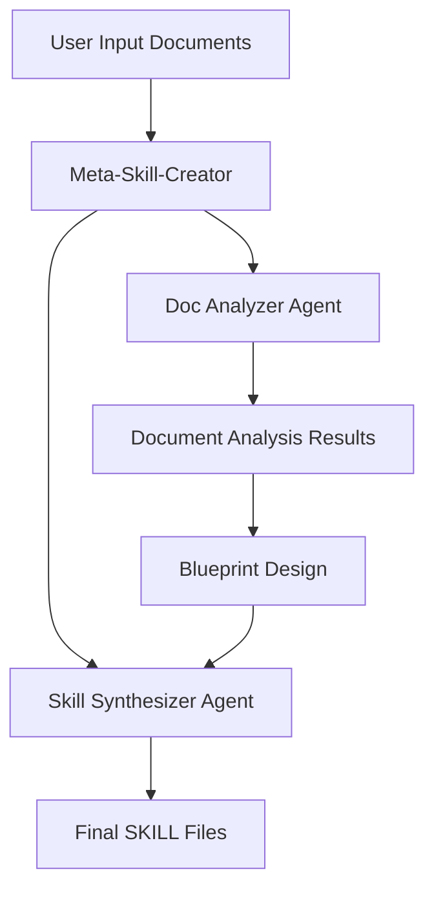

# Meta-Skill-Creator 🚀

A powerful Claude skill automation generation tool that automatically generates structured Claude Skills from technical documentation, supporting collaborative blueprint design and progressive content disclosure.

[](https://www.anthropic.com/engineering/equipping-agents-for-the-real-world-with-agent-skills)
[](LICENSE)

## ✨ Key Features

- 🔄 **Automated Skill Generation**: Generate standard Claude Skills from technical documentation with one click
- 🎯 **Intelligent Blueprint Design**: Support multiple skill planning options (Complete SDK, Core Functionality, Modular)
- 📚 **Progressive Content Disclosure**: Adopt three-tier information disclosure architecture to optimize context usage
- 🤖 **Multi-Agent Collaboration**: Implement document analysis and skill synthesis through professional sub-agents
- 🛠️ **Standardized Output**: Strictly follow Anthropic skill standards and best practices

## 🏗️ How It Works

### Agent Skills Architecture

This project is based on Anthropic's Agent Skills concept, packaging professional knowledge into composable resources:

1. **Level 1: Metadata** - System prompt information always loaded (~100 words)
2. **Level 2: Main Content** - SKILL.md loaded when skill is triggered (<5k words)
3. **Level 3: On-demand Resources** - Detailed documents in references/ directory

### Core Agent Architecture



#### 1. Meta-Skill-Creator (Main Agent)
- **Role**: Chief architect and sole user interaction point
- **Responsibility**: Coordinate the entire document-to-skill automated workflow
- **Features**: Uses progressive information disclosure, intelligently determines skill triggering timing

#### 2. Doc Analyzer Agent (Document Analysis Expert)
```json
{
  "input": ["Document file name", "Original document content"],
  "output": {
    "file": "document-name.md",
    "summary": "Document overview (1-2 sentences)",
    "toc": ["Chapter 1", "Chapter 2"],
    "key_apis": ["generateText", "streamText"],
    "common_patterns": ["asynchronous calls", "error handling"],
    "related_docs": ["ui.md", "providers.md"]
  }
}
```

#### 3. Skill Synthesizer Agent (Skill Synthesis Expert)
- **Responsibility**: Render structured blueprints and analysis results into standard skill files
- **Features**: Strictly follow template rendering and progressive disclosure principles
- **Output**: SKILL.md and references/ directory compliant with Anthropic standards

## 📋 Usage Workflow

### Step 1: Collect Raw Materials
```bash
# Automatically create temporary directories and collect documents
temp-skills/temp-jsons/  # Store analysis results
temp-skills/references/  # Copy original .md documents
```

### Step 2: Generate Plan (Planning Phase)
The system provides multiple skill planning options based on document analysis:

#### 🎯 Option A: Complete SDK Skill
- **Suitable for**: Large comprehensive skills containing all modules
- **Features**: Complete coverage, one-stop solution
- **Recommended for**: Complete API libraries or framework documentation

#### ⚡ Option B: Core Functionality Skill
- **Suitable for**: Streamlined skills focusing on most commonly used APIs
- **Features**: Lightweight and efficient, quick to get started
- **Recommended for**: Specific functions or tool sets

#### 🧩 Option C: Modular Skill Set
- **Suitable for**: Multiple small skills split by functional domain
- **Features**: Flexible combination, on-demand loading
- **Recommended for**: Large platforms or ecosystem documentation

### Step 3: Design Blueprint (User Collaboration)
Configure skills in detail based on selected plan:

```json
{
  "skill_name": "your-skill-name",
  "skill_description": "This skill should be used when users need to...",
  "modules": {
    "core": { "source_docs": ["core.md"] },
    "ui": { "source_docs": ["ui.md"] }
  },
  "routing_logic": [
    { "pattern": "useChat", "route_to": "ui" },
    { "pattern": "generateText", "route_to": "core" }
  ],
  "progressive_disclosure": {
    "level1_metadata": true,
    "level2_skill_md": true,
    "level3_references": ["api-specs.md", "examples.md"]
  }
}
```

### Step 4: Execute Build
Call Skill Synthesizer Agent to generate standardized skill structure:

```
your-skill-name/
├── SKILL.md              # Main skill documentation
└── references/           # Original technical documents
    ├── core.md
    ├── ui.md
    └── examples.md
```

## 🎯 Core Advantages

### 🔄 High Degree of Automation
- Zero-code configuration, one-click generation
- Intelligent document analysis and structure extraction
- Automated skill standardization

### 📊 Context Optimization
- Progressive information disclosure, avoiding context waste
- Intelligent routing, precise content localization
- Modular design, on-demand loading

### 🛡️ Quality Assurance
- Strictly follow Anthropic skill standards
- Automated quality checking and validation
- Complete test coverage checklist

### 🎨 Excellent User Experience
- Collaborative blueprint design
- Multiple plan options
- Real-time preview and iteration

## 🚀 Quick Start

### Requirements
- Claude Code environment
- Supported document formats: Markdown (.md)
- Recommended document structure: Technical documentation, API documentation, SDK documentation

### Usage Example

1. **Prepare Document Directory**
```bash
your-docs/
├── core.md          # Core API documentation
├── ui.md            # UI component documentation
├── providers.md     # Provider integration documentation
└── examples.md      # Examples and tutorials
```

2. **Launch Skill Generation**
```bash
skill: "Meta-Skill-Creator"
```

3. **Follow Configuration Prompts**
- Provide document directory path
- Select skill planning option
- Confirm skill name and description
- Review generation results

## 📁 Output Structure

Generated skills will follow standard structure:

```
your-skill-name/
├── SKILL.md                    # Main skill documentation (Level 2)
│   ├── YAML frontmatter        # Metadata (Level 1)
│   ├── Core Functionality      # Core functionality overview
│   ├── When to Use            # Usage scenarios
│   ├── Workflow               # Workflow
│   └── Resource References    # Resource references
└── references/                # Detailed documentation (Level 3)
    ├── core.md               # Original core documentation
    ├── ui.md                 # Original UI documentation
    └── ...                   # Other original documents
```

## 🔧 Quality Checklist

The system automatically validates the following standards:

- [ ] Output directory is `[skill-name]/`
- [ ] SKILL.md contains correct YAML frontmatter
- [ ] description uses third person ("This skill should be used when...")
- [ ] Original documents have been copied to references/ directory using `cp`
- [ ] Simplified directory structure (SKILL.md + references/)
- [ ] All resource reference paths point to original documents
- [ ] Routing logic covers key APIs
- [ ] Skill name uses kebab-case format
- [ ] Follow progressive disclosure principles

## 🎨 Best Practices

### Document Preparation
- Use standard Markdown format
- Maintain clear document structure
- Include actual code examples
- Provide complete API documentation

### Skill Design
- Clearly define usage scenarios
- Reasonably plan module structure
- Set intelligent routing rules
- Optimize information disclosure levels

### Quality Optimization
- Regularly update skill content
- Collect user feedback
- Monitor usage patterns
- Continuously iterate and improve

## 🤝 Contributing

Contributions are welcome! Please:

1. Fork this repository
2. Create your feature branch (`git checkout -b feature/AmazingFeature`)
3. Commit your changes (`git commit -m 'Add some AmazingFeature'`)
4. Push to the branch (`git push origin feature/AmazingFeature`)
5. Open a Pull Request

## 📄 License

This project is licensed under the MIT License - see the [LICENSE](LICENSE) file for details.